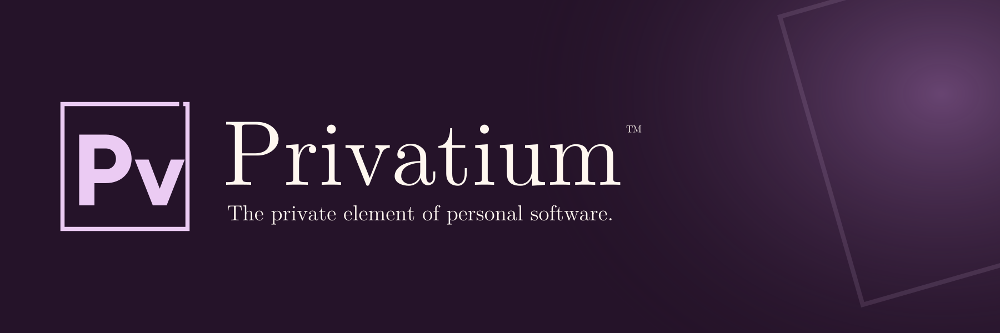

<!--
Project:  Privatium™
File:     README.md
Authors:  Gabriel Mongefranco (@gabrielmongefranco)
Created:  2026-08-31
Modified: 2026-09-05
Summary:  Overview, quick start, examples, and documentation index for Privatium.
Copyright © 2026 Gabriel Mongefranco
Privatium™ is a trademark of Gabriel Mongefranco.
Documentation license: GFDL-1.3-or-later, with no Invariant Sections,
                      no Front-Cover Texts, and no Back-Cover Texts.
Software license: GPL-3.0-or-later.
See the License and Credits sections below for the full notices and attribution.
-->



# Privatium™

***The private element of personal software.***

## Description

Privatium™ is an open-source, local-first framework for building and running personal apps
on your own devices. Use it to create a tracker, organize a collection, or build a small
web app that does exactly what you need. Your apps and data stay on hardware you control,
without cloud subscriptions or a separate database server.

Built in Rust with Lua and SQLite, Privatium makes self-hosted apps easier to create and
maintain. Start with an example, adapt it yourself, or ask an AI assistant to help. You can
write simple pages in Lua, use your own HTML and JavaScript, or build a standalone Rust
app. Run one app or keep several together. Back up your data by copying a folder.

The goal is personal software that follows you across devices without giving up data
ownership. Planned peer-to-peer sync will connect your devices without requiring a domain
name, DNS setup, or port forwarding for native clients. Local apps work today; device
pairing, sync, and remote access are being added in [Phases 2–5](docs/roadmap.md).

## Quick Start Guide

You can run Privatium on Windows, macOS, or Linux. Lua and SQLite are included.

1. **Download Privatium.** Choose the file for your computer from the
   [releases page](https://github.com/gabrielmongefranco/privatium/releases). Before the
   first release, development builds are available under **Artifacts** in successful
   [CI runs](https://github.com/gabrielmongefranco/privatium/actions/workflows/ci.yml)
   on `main` (GitHub sign-in required). Extract the download into a folder.
2. **Create a starter app.** Open a terminal in that folder and run:

   ```sh
   ./privatium new myapp
   ```

   On Windows, use `./privatium.exe` in place of `./privatium`.
3. **Run your app.** In the same terminal, run:

   ```sh
   ./privatium
   ```

4. **Open it in your browser.** Visit [Privatium on your computer](http://127.0.0.1:8420/)
   and select **myapp**. Keep the terminal open while using your apps. Access from another
   device is planned for Phase 2.

To customize your app, edit the files in the folder printed when you created it, then
refresh your browser. The [example apps](#example-applications) provide more starting points.
See [backup and restore](docs/backup-and-restore.md) for saving your data and
[command-line options](spec/cli.md) for development commands.

**Building from source?** Run `cargo build --release` from a checkout with the Rust
version in `rust-toolchain.toml`. The program is written to `target/release/`.
To use Privatium inside your own Rust application, see the
[embedded example](crates/privatium-core/examples/embedded.rs).

## Documentation

| Document | Purpose |
|---|---|
| [docs/architecture.md](docs/architecture.md) | How the system is put together, and why |
| [spec/protocol.md](spec/protocol.md) | **Normative.** Wire formats, events, discovery, pairing, sync |
| [spec/app-contract.md](spec/app-contract.md) | **Normative.** The three app tiers and three deployment modes |
| [spec/lua-api.md](spec/lua-api.md) | **Normative.** Tier 1 — the Lua API and LSP templates |
| [spec/data-api.md](spec/data-api.md) | **Normative.** The data API custom front ends build against |
| [spec/data-dictionary.md](spec/data-dictionary.md) | System tables, app index, field definitions |
| [spec/cli.md](spec/cli.md) | **Normative.** Command line, and the lint rules the skills enforce |
| [docs/security.md](docs/security.md) | Threat model and what is actually protected |
| [docs/connectivity.md](docs/connectivity.md) | Bootstrap and reachability per client type |
| [docs/deployment.md](docs/deployment.md) | Topologies, the always-on machine, per-OS firewall behaviour |
| [docs/backup-and-restore.md](docs/backup-and-restore.md) | The restore drill, for non-technical users |
| [docs/roadmap.md](docs/roadmap.md) | Build phases and acceptance criteria |
| [docs/frameworks.md](docs/frameworks.md) | Which libraries, frameworks and game engines fit, and which do not |
| [docs/skills.md](docs/skills.md) | How LLM-authored apps get correct, accessible, secure code |
| [docs/icons.md](docs/icons.md) | Icon system: Bootstrap Icons, inlined server-side |
| [docs/decisions/](docs/decisions/) | Decision records: Barracuda declined (0001); Rust core, pkarr, peer transport (0002); one core interface behind three transports (0003); Gun, RxDB, libp2p, SharkTrustX and BAS-in-Rust declined (0004); what a phone is in the cluster (0005); SQLite as the query engine (0006) |
| [docs/plans/](docs/plans/) | The per-phase work breakdowns: Phase 1 as built, Phases 2 and 3 as planned, later phases as stubs to be written from the roadmap |
| [docs/naming.md](docs/naming.md) | Name, taglines, and the rename checklist |
| [docs/phase-prompt-template.md](docs/phase-prompt-template.md) | The copy-and-paste prompt for starting a phase, milestone or change in a new AI chat |

## Example Applications

These small apps show what you can build. They appear in the launcher when you run
Privatium from a source checkout:

- **[Hello](apps/hello)** — a simple Lua app with a form and a list. Start here.
- **[Animals](apps/animals)** — a guessing game that learns new animals as you play.
- **[Sketch](apps/sketch)** — a drawing app built with HTML and JavaScript.

[AI assistant guides](docs/skills.md) help an assistant build apps that follow Privatium's
requirements, including security and accessibility.

The first real application, a medication fill and prior-authorization tracker, will be
built as a separate repository once this framework is proven.

## About the Author

Privatium is built by [Gabriel Mongefranco](https://gabriel.mongefranco.com), a database and
software architect who has spent two decades building data platforms in healthcare and
research — enterprise data warehouses, BI systems, knowledge bases, and the first architecture for mobile and
wearable research data at a large research university.

Learn more at: https://gabriel.mongefranco.com


## Contact

Questions, bug reports, enhancement ideas and requests are welcome as GitHub issues. Feel free to send pull requests as well!


## Credits

### This work is based in part on the following projects and libraries:

- [SQLite](https://sqlite.org/) — the in-process SQL engine the event log is materialized
  into, via [rusqlite](https://github.com/rusqlite/rusqlite); public domain, on every
  platform the framework targets.
- [HTMX](https://github.com/bigskysoftware/htmx) and [Alpine.js](https://github.com/alpinejs/alpine)
  — server-rendered interactivity and local reactivity, both without a build step.
- [Lua](https://www.lua.org/) and [mlua](https://github.com/mlua-rs/mlua) — the Tier 1
  application language and its Rust bindings.
- [Mako Server / Barracuda App Server](https://github.com/RealTimeLogic/BAS) — Real Time
  Logic's Lua Server Pages inspired this project's Tier 1 template engine and much of its
  developer-experience goal. No code from those projects was used. See [docs/decisions/0001](docs/decisions/0001-barracuda-evaluation.md).
- [Bootstrap Icons](https://github.com/twbs/icons) — MIT-licensed SVG icon set, vendored
  and inlined server-side; the only icon source used anywhere in the project.
- [DataLaVista](https://github.com/DepressionCenter/datalavista) — its normalization
  pipeline informed the list of date, time and timestamp spellings the framework accepts
  on write (`spec/lua-api.md §3.3`): ISO, Excel-style `M/D/YYYY`, Oracle-style
  `DD-MMM-YY`, long month names, and epochs. No code from that project was used; the
  parser is the framework's own.
- [Animal](https://github.com/coding-horror/basic-computer-games/tree/main/03_Animal) —
  the `apps/animals` example follows the classic "Animal" guessing game from
  David H. Ahl's *BASIC Computer Games* (1973), preserved and ported to many
  languages by the basic-computer-games project under the Unlicense. No code is
  copied: that project's Lua port is a console program with an in-memory tree,
  while this one stores the tree as an append-only event log so it can sync
  across devices.

### Chosen for the later phases of `docs/roadmap.md`, and not yet in the build:

- [iroh](https://github.com/n0-computer/iroh) — QUIC-based peer-to-peer transport with
  hole punching, for direct node-to-node sync (Phase 5).
- [pkarr](https://github.com/pubky/pkarr) — signed DNS records on the BitTorrent mainline
  DHT, which is how a public key will become an address with no registrar (Phase 5).
- [Arti](https://gitlab.torproject.org/tpo/core/arti) — the Tor Project's Rust
  implementation of Tor, for in-process onion service hosting with no external daemon
  (Phase 5).
- [Noble cryptography](https://github.com/paulmillr/noble-curves) — audited, dependency-free
  JavaScript implementations of X25519, Ed25519 and ChaCha20-Poly1305, needed because
  `crypto.subtle` is unavailable on plain-HTTP origins (Phase 2).
- [Tauri](https://github.com/tauri-apps/tauri) — desktop and mobile application shells
  (Phase 4).
- [SPAKE2 (RFC 9382)](https://www.rfc-editor.org/rfc/rfc9382.html) — the
  password-authenticated key exchange for device pairing (Phase 2), implemented on both
  sides from the libraries above rather than taken as a package.
- [Magic Wormhole](https://github.com/magic-wormhole/magic-wormhole) — inspiration for the
  short human-readable pairing code experience. No code from that project will be used.

## License

### Copyright Notice

Copyright © 2026 Gabriel Mongefranco

### Trademark Notice

Privatium™ is a trademark of Gabriel Mongefranco.

### Software and Library License Notice

This program is free software: you can redistribute it and/or modify it under the terms
of the GNU General Public License as published by the Free Software Foundation, either
version 3 of the License, or (at your option) any later version.

This program is distributed in the hope that it will be useful, but WITHOUT ANY WARRANTY;
without even the implied warranty of MERCHANTABILITY or FITNESS FOR A PARTICULAR PURPOSE.
See the GNU General Public License for more details.

You should have received a copy of the GNU General Public License along with this program.
If not, see <https://www.gnu.org/licenses/gpl-3.0-standalone.html>.

### Documentation License Notice

Permission is granted to copy, distribute and/or modify the documentation in this
repository under the terms of the GNU Free Documentation License, Version 1.3 or any later
version published by the Free Software Foundation; with no Invariant Sections, no
Front-Cover Texts, and no Back-Cover Texts. See
<https://www.gnu.org/licenses/fdl-1.3-standalone.html>

## Citation

If you find this repository or its specifications useful, please cite it.

> *Mongefranco, Gabriel (2026). Privatium™. Software. <https://github.com/gabrielmongefranco/privatium>*

---

Copyright © 2026 Gabriel Mongefranco
